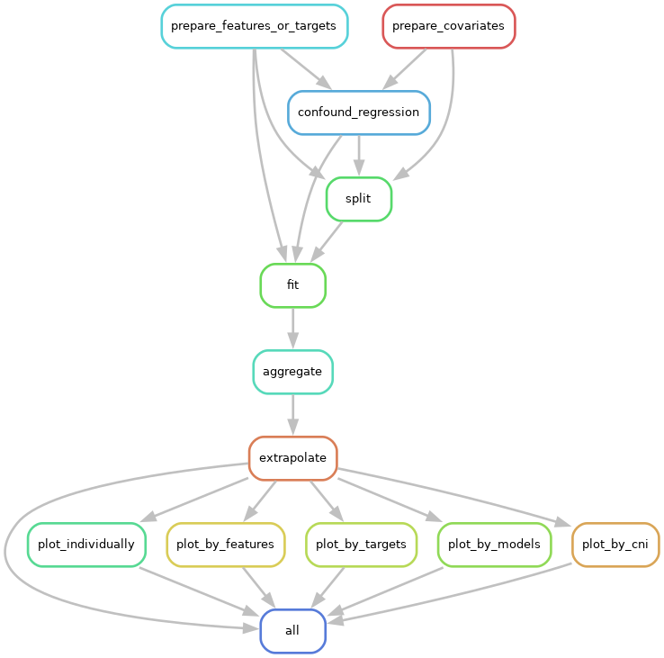

# Empirical Sample Complexity Estimator

The Empirical Sample Complexity Estimator provides a Snakemake workflow to analyze the performance of machine learning models as the sample size increases. The goal of the workflow is to make it easy to compare the scaling behaviour of various machine learning models, feature sets, and target variables.

For more information, refer to the following publication:

[Schulz, M. A., Bzdok, D., Haufe, S., Haynes, J. D., & Ritter, K. (2022). Performance reserves in brain-imaging-based phenotype prediction. BioRxiv, 2022-02.](https://biorxiv.org/content/10.1101/2022.02.23.481601v1.full)

---

## Installing Snakemake

In order to use this workflow, you must have either Anaconda or Miniconda installed and Snakemake must be installed. 

For Linux users without conda installed, you can use this [step by step buide](https://dev.to/waylonwalker/installing-miniconda-on-linux-from-the-command-line-4ad7) to install miniconda and mamba for this project.

To avoid incompatible dependencies, we recommend that you start by creating a new conda environment. 

Once you activate the environment, first install Snakemake using the following command, then install other packages:

```
conda install -c bioconda snakemake
```

If you encounter any issue installing snakemake, try following the [official installation steps] (https://snakemake.readthedocs.io/en/stable/getting_started/installation.html#installation-via-conda):

1. install mamba and other packages
```
conda install -n base -c conda-forge mamba
```

2. activate conda environment and install snakemake in another environment
```
$ conda activate base
$ mamba create -c conda-forge -c bioconda -n snakemake snakemake
```

3. Once you install snakemake into an isolated software environment, activate it with:
```
$ conda activate snakemake
```

Use the help function if there's any issue:
```
$ snakemake --help
```
---

## Example Workflow

To try the example workflow, check out the [example/](example/) directory and run the following command:

```
snakemake --cores 1 --configfile example/example_config.yaml --rerun-triggers mtime --use-conda --rerun-incomplete all
```

Once the workflow has completed, you can view the results in the `results/example-dataset/statistics` directory and the plots in `results/example-dataset/plots`.

---

## Configuration

For more information on the configuration file, see [here](config/README.md).

---

## Workflow Structure

The workflow is designed to process datasets that include multiple feature sets, multiple target variables, and covariates-of-no-interest. The features, targets, and covariates are standardized (`rule: prepare_features_and_targets` and `rule prepare_covariates`). Additional feature sets are created by correcting for covariates (`rule: confound_regression`).

For each combination of feature set, target variable, and covariate, the workflow removes rows with missing or NaN values and creates train/validation/test splits for each sample size and random seed defined in the configuration file (`rule: split`). The splits are saved to `results/dataset/splits` so they can be reused if additional models or repetition seeds are added to the configuration.

The workflow then fits and evaluates machine learning models (`rule: fit`) with a range of hyperparameters. The results are saved to `results/dataset/fits`.

The workflow collects the accuracy estimates for the best-performing hyperparameter configurations and writes them to summary files in `results/dataset/scores` (`rule: aggregate`). The accuracy estimates are then used to fit power laws to the data (`results/dataset/statistics/*.stat.json`, `rule: extrapolate`), using bootstrapping to estimate uncertainties (`results/dataset/statistics/*.bootstrap.json`).

Finally, the workflow creates summary figures based on the `.stat.json` and `.bootstrap.json` files. There are five types of figures: individual learning curves for each prediction setup (`plot_individually`), figures aggregating over all feature sets (`plot_by_features`), figures aggregating over all target variables (`plot_by_targets`), figures aggregating over all machine learning models (`plot_by_features`), and figures aggregating over all confound corrections approaches (`plot_by_cni`).


Here is a visualisation of the workflow



it was created via `snakemake --forceall --rulegraph --configfile example/example_config.yaml | dot -Tpng > dag.png` (requires graphviz)


## Documentation

Besides the detailed comments in all `workflow/scripts/` files provided to help you understand the codes, by running the following code, you will be able to read through our html formatted documentation built with `Sphinx`: 

```
sphinx-build -v -b html docs/ docs/_build/
```

## Testing

```
pip install pytest
python -m pytest -s tests/
```